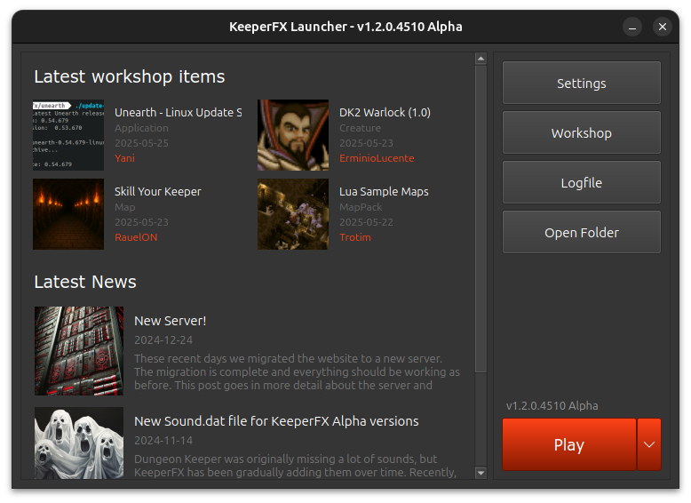

# KeeperFX Launcher

Modern cross platform KeeperFX launcher made using C++ and the Qt6 framework. Based on [ImpLauncher](https://keeperfx.net/workshop/item/410/implauncher-beta).

Codename: **CutieLauncher**



## Download

You can download it from the KeeperFX workshop: https://keeperfx.net/workshop/item/739/cutielauncher-alpha

## Building

- Get QT Creator
- Setup a local build kit (Qt6+)
- Load the project (by opening CMakeLists.txt)
- Build it

The CMake files still need to be fixed for Windows building.

## Building a Release version

There is currently a script that uses docker to create a build environment and then uses it to build and package the launcher for Windows.

This script is currently Linux only and should probably only be used for building the actual release versions.

```
./compile-win64s.sh
```

Build a static Windows release and package it with InnoSetup:

```
./compile-wind64s.sh release --installer
```

## Linux

A Linux version of the launcher will be released when KeeperFX itself works natively on Linux. All of the functionality should already work on Linux but 
before we know exactly how KeeperFX will be shipped, there's not much reason to already be releasing these builds. 

If you really want a Linux binary you can already build it and it should work out of the box.
It uses **Wine** to start `keeperfx.exe` and if it's running in a Flatpak it will use Wine on the host machine.

## Discord

Discord thread: https://discord.com/channels/480505152806191114/1285667371272376430  
You need to have access to the KeeperFX development channel on the Keeper Klan Discord to access it.
Just ask if you need it. We're always glad to have more developers helping us out.

## Translations

The launcher uses translations and should match the languages that are also available in the game.

If you wish to help out with translations or want more information, you can read the following: [Translating the KeeperFX Launcher](./docs/translations.md).

## License

This project is licensed under the GNU General Public License v2.0. Feel free to use, modify, and distribute it according to the terms of this license.
